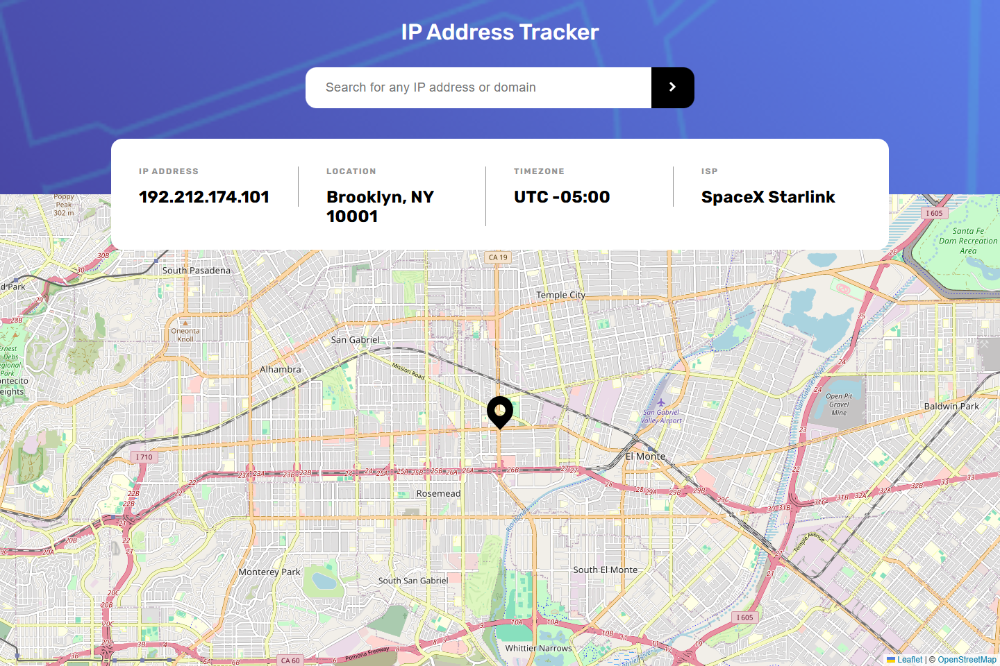
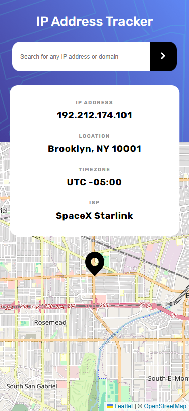
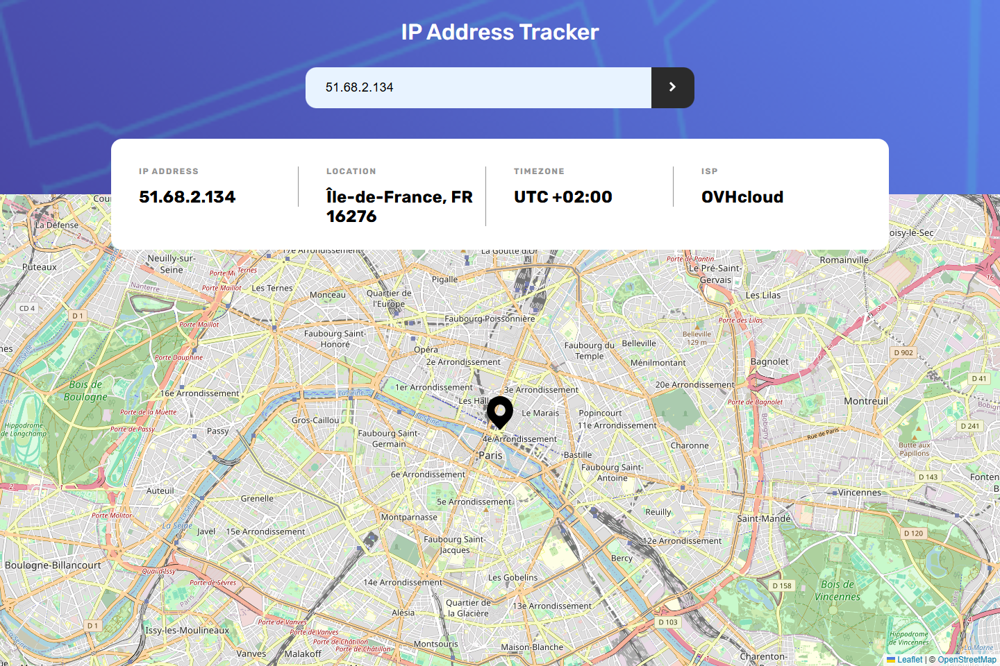
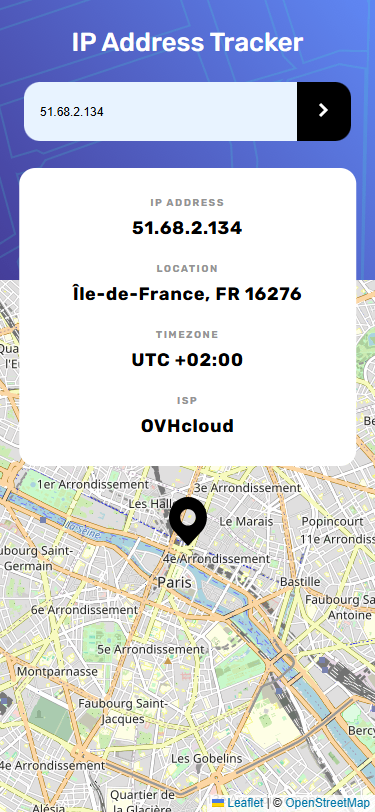

# 🌍 IP Address Tracker

Учебный проект с [Frontend Mentor](https://www.frontendmentor.io/).  
Приложение позволяет искать IP-адреса или домены и отображает их на карте вместе с дополнительной информацией (местоположение, часовой пояс, ISP).  

## 🚀 Live Demo
👉 [Посмотреть на GitHub Pages](https://lizakein.github.io/ip-address-tracker/)

---

## ✨ Функциональность
- Поиск информации по IP-адресу или домену  
- Отображение данных:
  - IP Address
  - Location (регион, страна, ASN)
  - Timezone (UTC)
  - ISP  
- Интерактивная карта с помощью **Leaflet.js**  
- Валидация IP перед запросом  
- Сообщения обновляются динамически через DOM  
- Адаптивная верстка (mobile-first)  

---

## 🛠️ Технологии
- **HTML5**, **CSS3** (адаптив, mobile-first)
- **JavaScript (ES6+)**
- **Leaflet.js** для карты
- Работа с **Geo.IPify API**  
- Макет из **Figma** (pixel perfect)

---

## 📦 Установка и запуск
1. Склонируйте репозиторий:
   ```bash
   git clone https://github.com/lizakein/todo-app.git
2. Вставьте свой api key в scripts/api-key.js (можно получить на [Geo.IPify](https://geo.ipify.org/))
3. Запустите локальный сервер
(или перейдите по [Live Demo](https://lizakein.github.io/ip-address-tracker/))

---

## 🎯 Чему я научился
- Подключать и использовать стороннее API
- Работать с Leaflet.js и картами
- Организовывать код в модули
- Реализовывать валидацию данных (IP-адреса)
- Создавать адаптивную верстку с подходом mobile-first
- Делать pixel-perfect по макету из Figma

---

# 📸 Скриншоты

**Страница по умолчанию**





**Страница, когда IP найден**





---

## 📌 Статус проекта

✅ Завершён (в рамках учебного задания)
Но в будущем можно добавить:
- обработку ошибок для доменных имён
- кэширование запросов
- выбор темы (light/dark)
